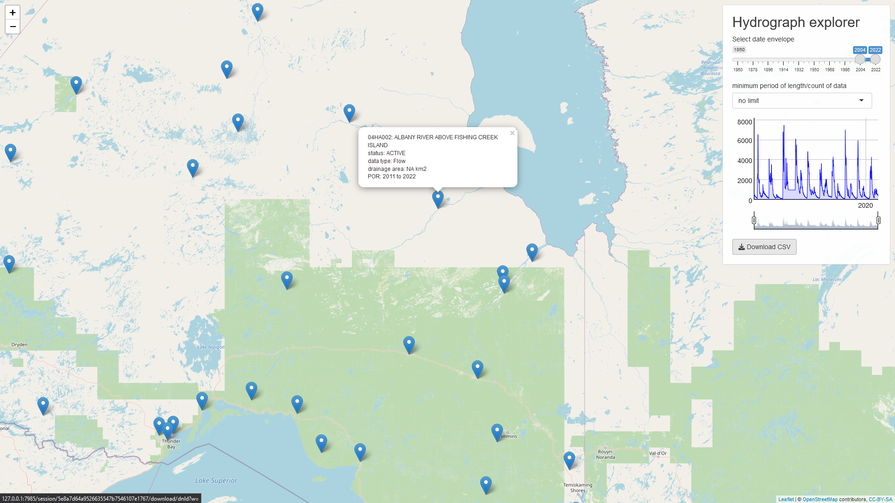

# sHYDAT
R-***Sh***iny interface to the Water Survey of Canada ***HYDAT*** database

- map interface to HYDAT locations
- hydrograph previewer *(at the moment: Flow only)*
- database .csv downloader

 

 

Formerly [*sHydrologyMap*](https://github.com/maseology/sHydrology) but stripped down to the essentials. Now handles the [***tidyhydata*** package](https://cran.r-project.org/web/packages/tidyhydat/vignettes/tidyhydat_an_introduction.html) by Sam Albers. 

sHydrologyMap in it's full capacity has been moved to: 

## Instructions

Open ***sHYDAT.Rproj*** in [RStudio](https://posit.co/download/rstudio-desktop/), then within RStudio open ***app.R*** and click `Run App`.

### When Running for the first time

Uncomment line `download_hydat()` when running, this will download the database. Thereafter, the function only needs to run periodically.
